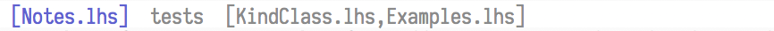

# vim-tabbar

A tabline replacement for vim.

## Features



By default, each tab's name is a list of the buffers in the tab's window.
Tabs can be renamed with the `tabbar#rename_current_tab()` function (when
called with no arguments, it opens an input dialog).

```vim
nnoremap <C-w>, :call tabbar#rename_current_tab()<cr>
```

##  Installation

Install with a plugin manager or copy directly into vim's runtime path.
